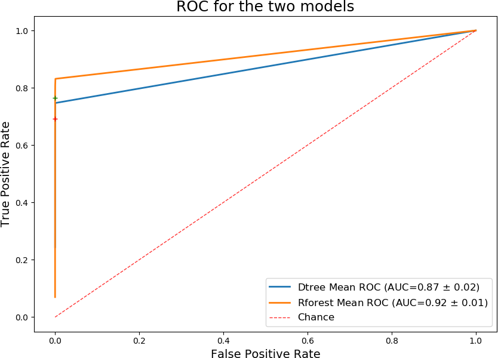

 <h1>Helping detect a rare disease</h1> 

**Author:** Leonardo Espin.

Date: 8/08/2019

[I constructed a decision-tree model and a random-forest model](https://leoespin.github.io/CHDI/) to help detect a condition with an incidence of less than 0.173% among patients (173 in 100,000). The models were built using the anonymized information of more than 280,000 patients, consisting of 30 anonymized variables per patient. Each patient is classified as either having the condition `'Class'=1`, or not having it `'Class'=0`.

